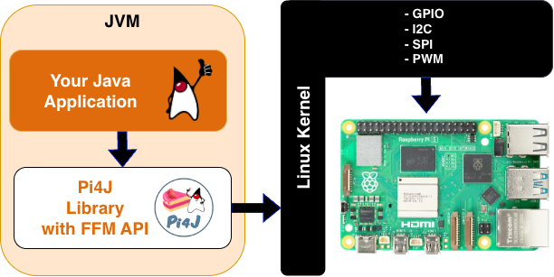

Pi4J :: Java I/O Library for Raspberry Pi
==========================================================================

[](https://central.sonatype.com/artifact/com.pi4j/pi4j-core)
[](https://central.sonatype.com/repository/maven-snapshots/com/pi4j/pi4j-core/maven-metadata.xml)
[](http://www.apache.org/licenses/LICENSE-2.0)

[](https://pi4j.com)
[](https://join.slack.com/t/pi4j/shared_invite/zt-1ttqt8wgj-E6t69qaLrNuCMPLiYnBCsg)
[](https://foojay.social/@pi4j)
[](https://be.linkedin.com/company/pi4j)

API documentation: [](https://apidia.net/mvn/com.pi4j/pi4j)

---

## Project Information

Project website: [pi4j.com](https://pi4j.com/).

This project is intended to provide a **friendly object-oriented I/O API and implementation libraries for Java Programmers** to access the **full I/O capabilities of the Raspberry Pi platform**. This project abstracts the low-level native integration and interrupt monitoring to enable Java programmers to **focus on implementing their application business logic**.



* Pi4J Discussions: [github.com/Pi4J/pi4j/discussions](https://github.com/Pi4J/pi4j/discussions)
* Pi4J Issues: [github.com/Pi4J/pi4j/issues](https://github.com/Pi4J/pi4j/issues)

Builds are available from:

* [Release builds from Maven Central](http://search.maven.org/#search%7Cga%7C1%7Ccom.pi4j)
* [Snapshot builds from Sonatype OSS](https://oss.sonatype.org/index.html#nexus-search;quick~pi4j)
* [Pi4J Downloads](https://pi4j.com/download)

## Using Pi4J

You need these Java 25+ runtimes to use Pi4J (V4+):

When you want to use Pi4J in your project, you should definitely check out [the Pi4J website](https://pi4j.com) where you can find a lot of information and many examples!

For example, for a minimal example to blink a LED ([fully explained here](https://pi4j.com/getting-started/minimal-example-application/)), you need to import the dependencies and use this code:

```java
var pi4j = Pi4J.newAutoContext();

var led = pi4j.digitalOutput().create(PIN_LED);

while (true) {
  if (led.state() == DigitalState.HIGH) {
    led.low();
  } else {
    led.high();
  }

  Thread.sleep(500);
}
```

## Contributing to Pi4J

For full description of the code structure, how to compile... see the ["About the code" on our website](https://pi4j.com/architecture/about-the-code/).


### Project Overview

Starting with Pi4J V2, the Pi4J project is prioritizing focus on providing Java programs access, control and communication with the core I/O capabilities of the Raspberry Pi platform. A separate repository [pi4j-drivers](https://github.com/Pi4J/pi4j-drivers) provides drivers for various electronic components, using the Pi4J library.

Read all about it on pi4j.com: [What's New in V2](https://www.pi4j.com/about/info-v2/), [in V3](https://www.pi4j.com/about/info-v3/), and [in V4](https://www.pi4j.com/about/info-v4/).

### Build Instructions

The Pi4J codebase can be built using [Apache Maven](https://maven.apache.org/) and [Java JDK 25 (since V4)](https://openjdk.java.net/). The following command can be used to build the Pi4J JARs:

```
mvn package
```

With `package` all modules in the Pi4J project will be built, and it shows you if the project can be successfully built. 
If you want to use the libraries locally on your Raspberry Pi, for example, for testing, replace `package` with `install`.

> **NOTE:** A comprehensive set of build instructions can be found in the [Pi4J Documentation](https://pi4j.com/architecture/about-the-code/build-instructions/).

### Adding a feature or solving a problem

If you have an idea to extend and improve Pi4J, please first create a ticket to discuss how
it fits in the project and how it can be implemented.

If you find a bug, create a ticket, so we are aware of it and others with the same problem can
contribute what they already investigated. And the quickest way to get a fix? Try to search for
the cause of the problem or even better provide a code fix!

### Join the team

You want to become a member of the Pi4J-team? Great idea! Send a short message to frank@pi4j.com
with your experience, ideas, and what you would like to contribute to the project.

## License

Pi4J Version 2.0 and later is licensed under the Apache License, Version 2.0 (the "License"); you may not use this file except in compliance with the License. You may obtain a copy of the License at: http://www.apache.org/licenses/LICENSE-2.0

Unless required by applicable law or agreed to in writing, software distributed under the License is distributed on an "AS IS" BASIS, WITHOUT WARRANTIES OR CONDITIONS OF ANY KIND, either express or implied. See the License for the specific language governing permissions and
limitations under the License. 

Copyright (C) 2012 - 2026 Pi4J
