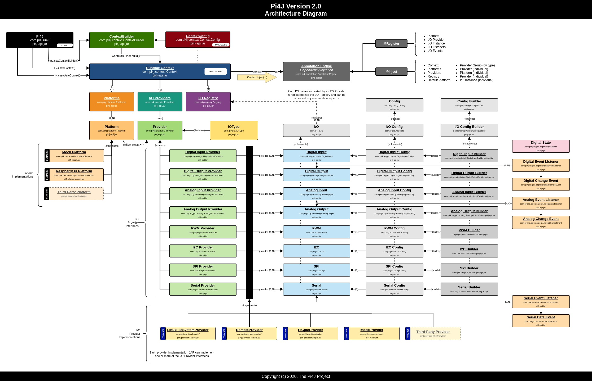
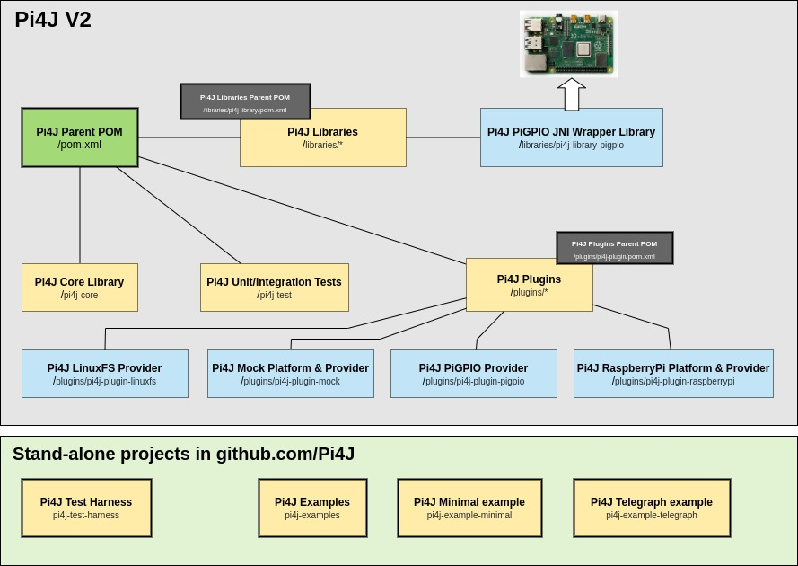

 Pi4J :: Java I/O Library for Raspberry Pi
==========================================================================

 

---

## DISCLAIMER:: EXPERIMENTAL VERSION

### This repository is an experimental and incomplete work-in-progress for the next major version of Pi4J.  Do not try using this project, it will not work at this time.

### !! NOT READY FOR PRODUCTION USE !!

---

## PROJECT INFORMATION

Project website: https://pi4j.com/  

Pi4J Community Forum (*new*): https://forum.pi4j.com/  
Version 2.0 Project Discussions (*new*): https://forum.pi4j.com/category/6/version-2-0  
Project issues list: https://github.com/Pi4J/pi4j/issues  
 
Release builds are available from:
   *  [Maven Central] http://search.maven.org/#search%7Cga%7C1%7Ccom.pi4j
   *  [Downloads] https://pi4j.com/download.html

Snapshot builds are available from:
   *  [Sonatype OSS] https://oss.sonatype.org/index.html#nexus-search;quick~pi4j
   *  [Downloads] https://pi4j.com/download.html

Copyright (C) 2012-2020 Pi4J

## CONTRIBUTING TO PI4J

For full description of the code structure, how to compile... see 
the ["Core code internals" on our website](https://v2.pi4j.com/core-code-internals).

### Adding a feature or solving a problem

If you have and idea to extend and improve Pi4J, please first create a ticket to discuss how 
it fits in the project and how it can be implemented. 

If you find a bug, create a ticket, so we are aware of it and others with the same problem can 
contribute what they already investigated. And the quickest way to get a fix? Try to search for 
the cause of the problem or even better provide a code fix!
    
### Join the team

You want to become a member of the Pi4J-team? Great idea! Send a short message to frank@pi4j.com 
with your experience, ideas, and what you would like to contribute to the project.

## LICENSE

 Pi4J Version 2.0 and later is licensed under the Apache License,
 Version 2.0 (the "License"); you may not use this file except in
 compliance with the License.  You may obtain a copy of the License at:
      http://www.apache.org/licenses/LICENSE-2.0

 Unless required by applicable law or agreed to in writing, software
 distributed under the License is distributed on an "AS IS" BASIS,
 WITHOUT WARRANTIES OR CONDITIONS OF ANY KIND, either express or implied.
 See the License for the specific language governing permissions and
 limitations under the License.

## PROJECT OVERVIEW

Starting with the Pi4J 2.0 builds, the Pi4J project is prioritizing focus
on providing Java programs access, control and communication with the core
I/O capabilities of the Raspberry Pi platform.  

**LINK BELOW TO BE CHANGED TO pi4j.com WHEN NEW SITE IS PUBLISHED**

Read all about it on [v2.pi4j.com](https://v2.pi4j.com/).

## IN DEVELOPMENT

2019-02-27 :: 2.0-SNAPSHOT

  * Changed project to Apache License, Version 2.0
  * Removed `pi4j-device` library.  _(See [v2.pi4j.com](https://v2.pi4j.com/what-is-new))_
  * Removed `pi4j-gpio-extension` library.  _(See [v2.pi4j.com](https://v2.pi4j.com/what-is-new))_
  * Removed platform support for `Odroid`, `BananaPi`, `BPi`, `NanoPi`, `OrangePi`.  _(See [v2.pi4j.com](https://v2.pi4j.com/what-is-new))_

## PREVIOUS RELEASES

For previous 1.x release notes and source code, please see the 1.x branch
or release tags in the source repository:

  * **Releases**: https://github.com/Pi4J/pi4j/releases
  * **Source Code**: https://github.com/Pi4J/pi4j/branches
